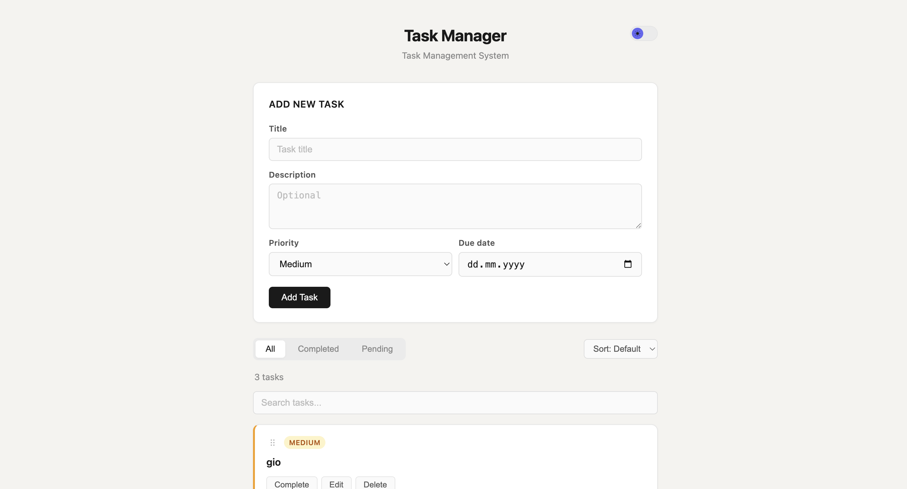
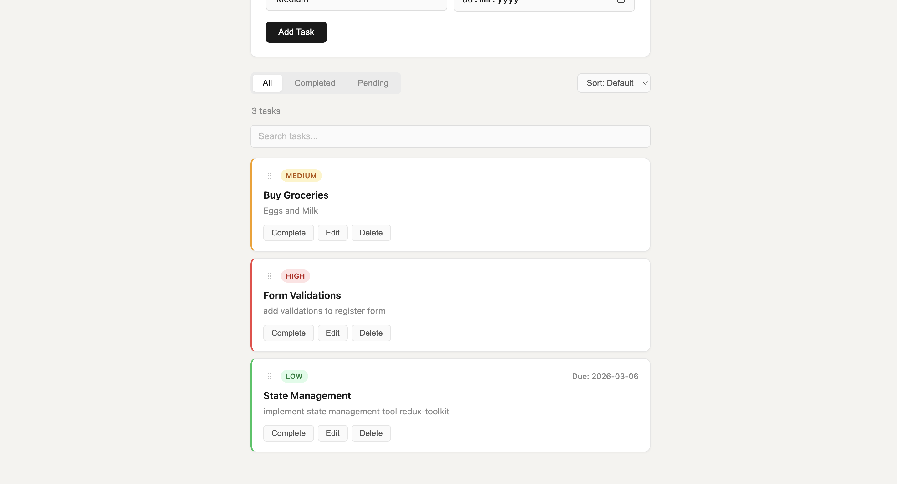
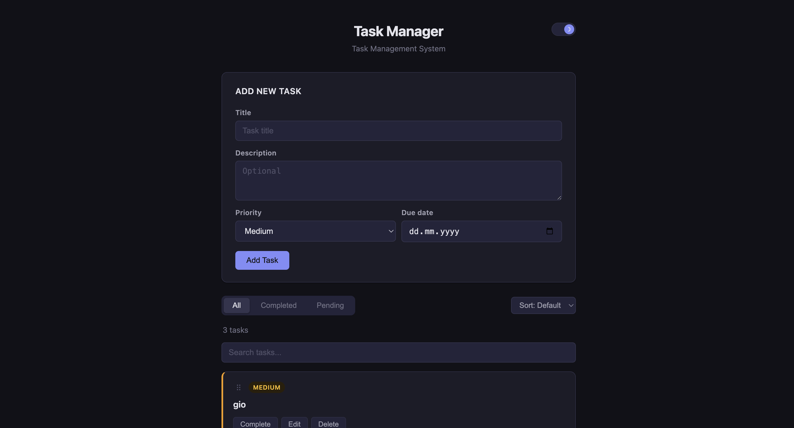
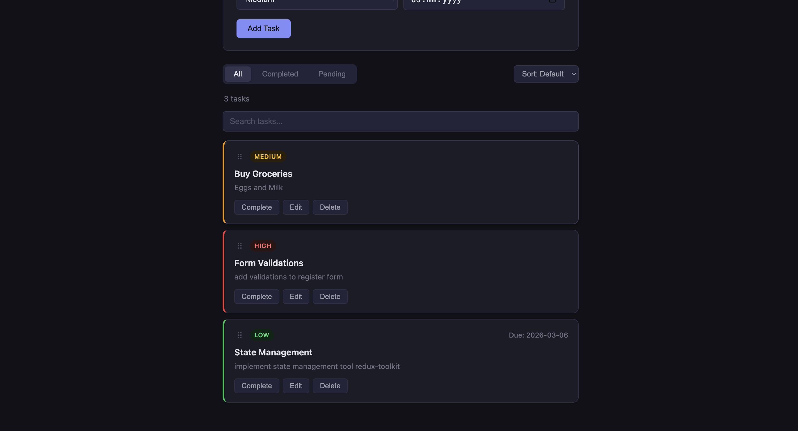

# Task Manager App

A full-stack task management app built with React and TypeScript on the frontend and Express on the backend. You can create, edit, delete and reorder tasks. It also has infinite scroll, drag and drop reordering, and a dark/light mode toggle.

## Screenshots

### Light Mode



### Dark Mode



---

## Setup

### Backend

```bash
cd backend
npm install
npm start
```

Runs on **http://localhost:4000**

### Frontend

```bash
cd frontend
npm install
npm start
```

Runs on **http://localhost:3000**

---

## API Endpoints

| Method | Endpoint | Description |
|--------|----------|-------------|
| GET | `/api/tasks` | Fetch tasks (supports `page`, `limit`, `sort`, `completed` query params) |
| POST | `/api/tasks` | Create a new task |
| PUT | `/api/tasks/:id` | Update a task by ID |
| DELETE | `/api/tasks/:id` | Delete a task by ID |
| PATCH | `/api/tasks/:id/toggle` | Toggle completed status |

### GET /api/tasks — Query Parameters

| Param | Values | Description |
|-------|--------|-------------|
| `page` | number | Page number (default: 1) |
| `limit` | number | Items per page (default: 10) |
| `sort` | `title`, `priority`, `createdAt` | Sort field |
| `completed` | `true`, `false` | Filter by completion status |

---

## Features

- **CRUD** — create, edit, and delete tasks with title, description, priority, and due date
- **Infinite scroll** — loads 10 tasks at a time and fetches more as you scroll down
- **Drag & drop reorder** — grab the handle on any task card to reorder; the custom order persists across page refreshes via `localStorage`
- **Filter & sort** — filter by All / Completed / Pending, sort by date, priority, or title
- **Search** — live client-side search with a task count that updates to 0 when nothing matches
- **Dark / light mode** — toggle in the top-right corner; picks up system preference on first visit and remembers your choice

---

## Design Decisions

**In-memory storage** — task data lives in a plain array on the backend. This keeps the setup dependency-free (no database needed), but data resets when the server restarts. A real deployment would use a persistent store like SQLite or Postgres.

**Drag order in localStorage** — since there's no persistent storage on the backend, custom drag order is saved client-side. When an explicit sort option (date, priority, title) is selected, the saved order is skipped in favor of the API's sort result.

**Server-side pagination** — keeps the initial page load fast regardless of how many tasks exist. The frontend accumulates pages in state and uses `IntersectionObserver` on a sentinel element at the bottom of the list to trigger the next fetch.

**Mouse-event drag & drop** — the native HTML5 Drag API has inconsistent behavior and limited visual control across browsers, so drag & drop uses `mousedown` / `mouseenter` / `mouseup` events instead. Items swap positions live as you move the cursor over them.

---

## Time Spent

| Part | Time |
|------|------|
| Frontend | ~3 hours |
| Backend | ~1.5 hours |
| **Total** | **~4.5 hours** |
